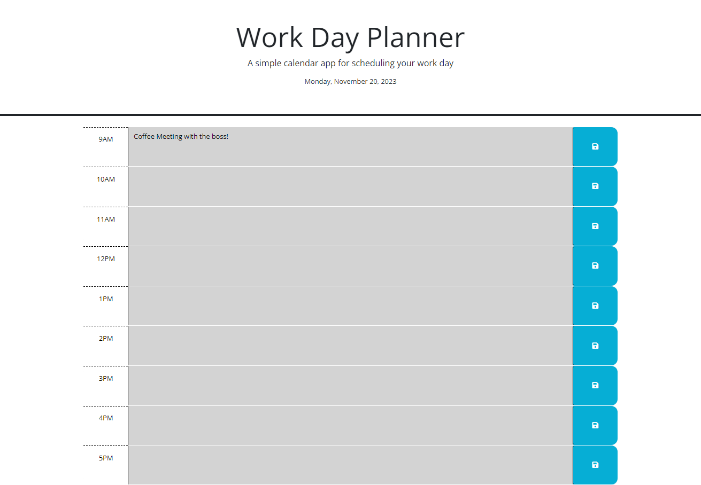

# work-day-planner

## Description

This is a basic work day planner, the user can add a meeting in the time slot and hit the save button, which will store the event to local storage. Once an event has been saved, this information will continue to appear, even after the page is reloaded. 

## Screenshot

## Link 

Live URL: https://phoenixpyra7.github.io/work-day-planner/ 
